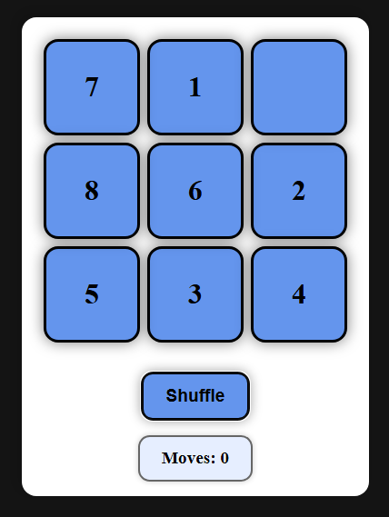

# Slide Puzzle

A slide puzzle game implemented in TypeScript. The game features a grid of numbered tiles that can be moved into an empty space to solve the puzzle.

<div align="center">

</div>

## Getting Started

```sh
npm -i
npm run dev
```
